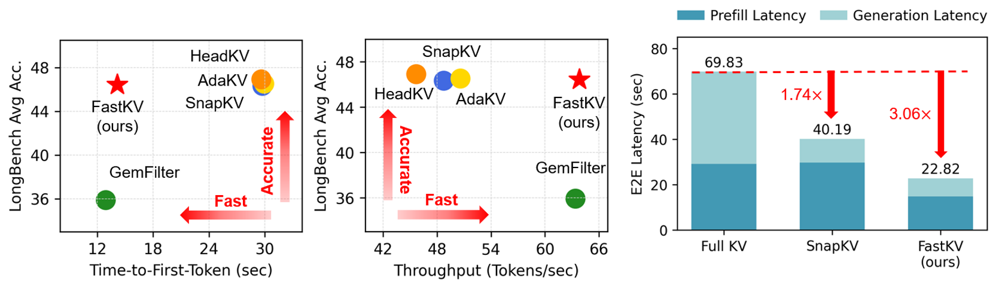

# FastKV: KV Cache Compression for Fast Long-Context Processing with Token-Selective Propagation

<p align="middle">
    <a href="https://arxiv.org/abs/2502.01068"></a>
</p>

<div align=center>

</div>
</br>

This is the official repository of **"FastKV: KV Cache Compression for Fast Long-Context Processing with Token-Selective Propagation"**.

* FastKV introduces a novel Token-Selective Propagation (TSP) approach, selectively propagating only critical tokens to layer layers while retaining full-context information in early layers.
* This method significantly reduces KV cache size while maintaining accuracy, leading to improved latency and efficiency in long-context processing of LLMs.
* Experiments results demonstrate that FastKV achieves up to**1.97×** speedup in time-to-first-token (TTFT) and **4.82×** throughput improvement, while maintaining less than 1% accuracy degradation compared to full-context inference on long-context benchmarks

<div align=center>

</div>

For more details, please check out our [paper](https://arxiv.org/abs/2502.01068).

## Usage
### 1. Installation
Installation with the requirements package.
```
conda create -n fastkv python=3.9
conda activate fastkv
cd FastKV
pip install -r requirements.txt
pip install flash-attn==2.6.3

# For AdaKV and HeadKV
cd baseline/adakv
make i
```

### 2. Quick Start
Inference with FastKV methods and evaluation for LongBench, Needle-in-a-Haystack, and speedup benchmark.
```
# Run LongBench Evaluation
./scripts/run_longbench.sh

# Run Needle-in-a-Haystack Evaluation
./scripts/run_needle.sh

# Run TTFT Benchmark
./scripts/run_ttft.sh

# Run Throughput Benchmark
./scripts/run_throughput.sh
```

## Model Support

|         | FastKV | GemFilter | SnapKV | AdaKV | HeadKV |
|:-------:|:------:|:---------:|:------:|:-----:|:------:|
|  LLaMA  |    O   |     O     |    O   |   O   |    O   |
| Mistral |    O   |     O     |    O   |   O   |    O   |

## Acknowledgements
Our implementation of FastKV is based on codes from [SnapKV](https://github.com/FasterDecoding/SnapKV) repository.

We have integrated the baseline methods ([SnapKV](https://github.com/FasterDecoding/SnapKV), [AdaKV](https://github.com/FFY0/AdaKV), [HeadKV](https://github.com/FYYFU/HeadKV), [GemFilter](https://github.com/SalesforceAIResearch/GemFilter)) for experiments and evaluations, thanks to their open-source contributions.

## Citation
If you use the FastKV approach in your research,  please consider citing:

```
@article{fastkv,
  title={FastKV: KV Cache Compression for Fast Long-Context Processing with Token-Selective Propagation},
  author={Dongwon Jo, Jiwon Song, Yulhwa Kim, Jae-Joon Kim},
  journal={arXiv preprint arXiv:2502.01068},
  year={2025}
  }
```
