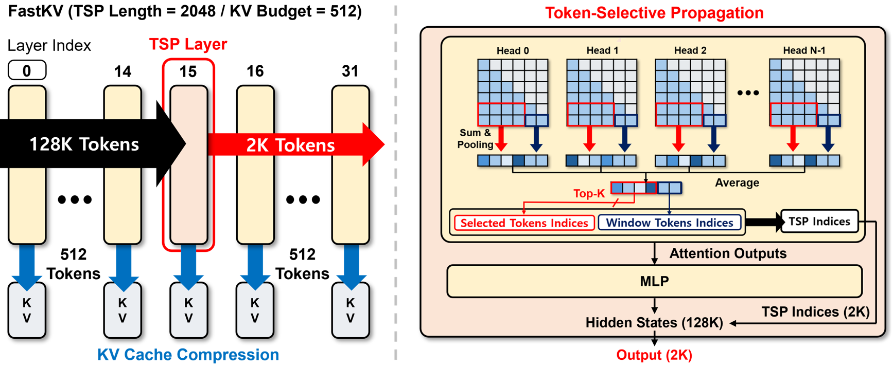

# FastKV: Decoupling of Context Reduction and KV Cache Compression for Prefill-Decoding Acceleration

<p align="middle">
    <a href="https://arxiv.org/abs/2502.01068"></a>
</p>

<div align=center>

</div>
</br>

This is the official repository of **"FastKV: Decoupling of Context Reduction and KV Cache Compression for Prefill-Decoding Acceleration"**.

* FastKV introduces a novel Token-Selective Propagation (TSP) approach, selectively propagating only critical tokens to layer layers while retaining full-context information in early layers.
* This method significantly reduces KV cache size while maintaining accuracy, leading to improved latency and efficiency in long-context processing of LLMs.
* Experiments results demonstrate that FastKV achieves up to **1.82×** speedup in prefill and **2.87×** speedup in decoding, while maintaining less than 1% accuracy degradation compared to full-context inference on long-context benchmarks

For more details, please check out our [paper](https://arxiv.org/abs/2502.01068).

## Usage
### 1. Installation
Installation with the requirements package.
```
conda create -n fastkv python=3.9
conda activate fastkv
cd FastKV
pip install -r requirements.txt
pip install flash-attn==2.6.3
```

### 2. Quick Start
Inference with FastKV methods and evaluation for LongBench, Ruler, Needle-in-a-Haystack, and speedup benchmark.

```
# Run LongBench Evaluation
./scripts/eval_longbench.sh

# Run RULER Evaluation
./scripts/eval_ruler.sh

# Run Needle-in-a-Haystack Evaluation
./scripts/eval_needle.sh

# Run E2E Latency Benchmark
./scripts/eval_e2e.sh

# Run Prefill Latency Benchmark
./scripts/eval_prefill.sh
```

## Model Support

|         | FastKV | GemFilter | SnapKV | StreamingLLM | H2O | PyramidInfer |
|:-------:|:------:|:---------:|:------:|:-----:|:------:|:------:|
|  LLaMA  |    O   |     O     |    O   |   O   |    O   |    O   |
| Ministral |    O   |     O     |    O   |   O   |    O   |    O   |

## Acknowledgements
Our implementation of FastKV is based on codes from [SnapKV](https://github.com/FasterDecoding/SnapKV) and [KVCache-Factory](https://github.com/Zefan-Cai/KVCache-Factory) repository.

We have integrated the baseline methods ([SnapKV](https://github.com/FasterDecoding/SnapKV), [PyramidInfer](https://github.com/mutonix/pyramidinfer), [StreamingLLM](https://github.com/mit-han-lab/streaming-llm), [H2O](https://github.com/FMInference/H2O), [GemFilter](https://github.com/SalesforceAIResearch/GemFilter)) for experiments and evaluations, thanks to their open-source contributions.

## Citation
If you use the FastKV approach in your research,  please consider citing:

```
@article{fastkv,
  title={FastKV: Decoupling of Context Reduction and KV Cache Compression for Prefill-Decoding Acceleration},
  author={Dongwon Jo, Jiwon Song, Yulhwa Kim, Jae-Joon Kim},
  journal={arXiv preprint arXiv:2502.01068},
  year={2025}
  }
```
